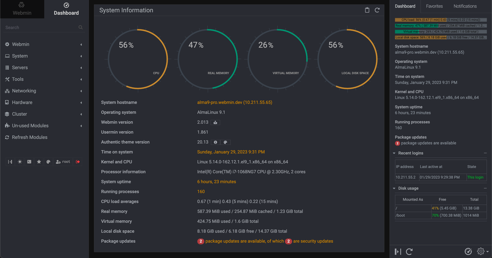

<!--
N.B.: This README was automatically generated by https://github.com/YunoHost/apps/tree/master/tools/README-generator
It shall NOT be edited by hand.
-->

# Webmin pour YunoHost

[](https://dash.yunohost.org/appci/app/webmin)  

[](https://install-app.yunohost.org/?app=webmin)

*[Read this readme in english.](./README.md)*

> *Ce package vous permet d’installer Webmin rapidement et simplement sur un serveur YunoHost.
Si vous n’avez pas YunoHost, regardez [ici](https://yunohost.org/#/install) pour savoir comment l’installer et en profiter.*

## Vue d’ensemble

Webmin est une interface Web pour l'administration système pour Unix. À l'aide de n'importe quel navigateur Web moderne, vous pouvez configurer des comptes d'utilisateurs, Apache, DNS, le partage de fichiers et bien plus encore. Webmin supprime le besoin de modifier manuellement les fichiers de configuration Unix comme « /etc/passwd » et vous permet de gérer un système depuis la console ou à distance.

**Version incluse :** 2.104~ynh2

## Captures d’écran



## Documentations et ressources

* Site officiel de l’app : <http://www.webmin.com>
* Dépôt de code officiel de l’app : <https://github.com/webmin/webmin>
* YunoHost Store: <https://apps.yunohost.org/app/webmin>
* Signaler un bug : <https://github.com/YunoHost-Apps/webmin_ynh/issues>

## Informations pour les développeurs

Merci de faire vos pull request sur la [branche testing](https://github.com/YunoHost-Apps/webmin_ynh/tree/testing).

Pour essayer la branche testing, procédez comme suit.

``` bash
sudo yunohost app install https://github.com/YunoHost-Apps/webmin_ynh/tree/testing --debug
ou
sudo yunohost app upgrade webmin -u https://github.com/YunoHost-Apps/webmin_ynh/tree/testing --debug
```

**Plus d’infos sur le packaging d’applications :** <https://yunohost.org/packaging_apps>